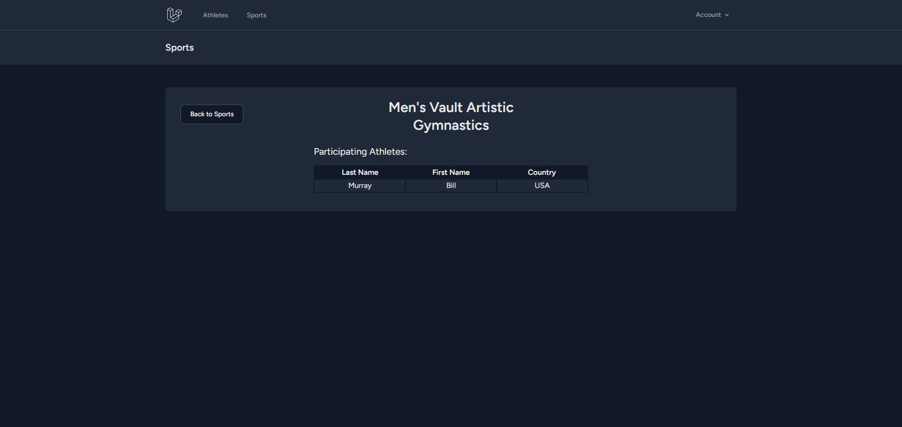

## About Olympic Tracker

Welcome to the Olympic Tracker CMS, a content management system designed to manage and track data related to Olympic sports and athletes built using the Laravel. The Olympic Tracker CMS is structured around two primary models: Sports and Athletes. These models allow for comprehensive data management, from the creation and categorization of various sports to the detailed profiling and tracking of athletes' performances.

## Database Structure

The two models provided are Sports and Athletes and they have a Many-To-Many relationship between each other. Below is the structure of all related tables

### sports

| key | column name | data type   | description                                        |
| --- | ----------- | ----------- | -------------------------------------------------- |
| PK  | id          | bigint(20)  | id of the sport                                    |
|     | name        | varchar(255)| the name of the sport eg. "Vault"                  |
|     | sport       | varchar(255)| the type of sport eg. "Artistic Gymnastics"        |
|     | division    | varchar(255)| the type of participants for the sport eg. "Men's" |

### athletes                                                                            
| key | column name | data type   | description                                        |
| --- | ----------- | ----------- | -------------------------------------------------- |
| PK  | id          | bigint(20)  | id of the athlete                                  |
|     | fname       | varchar(255)| the first name of the athlete eg. "John"           |
|     | lname       | varchar(255)| the last name of the athlete eg. "Doe"             |
|     | country     | varchar(255)| the country of the athlete eg. "Canada"            |
|     | gold        | int(11)     | the number of gold medals earned by the athlete    |
|     | silver      | int(11)     | the number of silver medals earned by the athlete  |
|     | bronze      | int(11)     | the number of bronze medals earned by the athlete  |
|     | division    | varchar(255)| the type of participants for the sport eg. "Men's" |

### athlete_sport                                                                        
| key | column name | data type   | description                                        |
| --- | ----------- | ----------- | -------------------------------------------------- |
| PK  | id          | bigint(20)  | id of the relationship                             |
| FK  | athlete_id  | bigint(20)  | the id of the athlete                              |
| FK  | sport_id    | bigint(20)  | id of the sport                                    |

## Features

### Authentication

This app provides different functionality for registered and unregistered users simulating admin/public functionality. Any unregistered user trying to access private pages will be redirected to the login. Registered users wil also see a dashboard which has links for all models currently in the database.

*Dashboard view for Registered Users*  

### Public Features - CRUD

The only CRUD features available to the public is read functionality. Unregistered users can view all sports and athletes present in the database at once by visiting the /sports and the /athlete pages.

*Sports view for Unregistered Users.*

*Athletes view for Unregistered Users.*

From those pages user can view more details about the item by clicking on the details link or by navigating directly to /sports/{id of sport} or /athletes/{id of athelete}. On these pages users are also able to see which athletes participate in the given sport and which sports the given athlete participates respectively.

*Sport Details view for Unregistered Users.*

*Athlete Details view for Unregistered Users.*

### Admin Features - CRUD

Like the public, registered users can also view all sports and athletes present in the database.

*Sports view for Registered Users.*

*Athletes view for Registered Users.*

Addtionally registered users also have the capability to create new sports and athletes and add them to the database by clicking the add button or navigating directly to /sports/create or /athletes/create. By completing the form the sport or athlete will be added to the database. When adding an athlete users can choose to assign sports to them also updating the relationship in the database.

*Create Sport view for Registered Users.*

*Create Athlete view for Registered Users.*

Once again like the public registered users can view more details about sports or athletes. Users can delete items by clicking the delete button or by navigating directly to /sports/trash/{id} or /athletes/trash/{id} (which redirects you after completing the delete)

*Sport Details view for Registered Users.*

*Athlete Details view for Registered Users.*

Unlike the public users can edit and delete the item from this page. Editing can be done by clicking the edit button or navigating directly to /sports/{id}/edit or /athletes/{id}/edit and completing the form. And 

*Edit Sport view for Registered Users.*

*Edit Sport view for Registered Users.*

## Closing thoughts on Laravel

This project was completed as part of the Web Development Project course at Humber College. As such I will share my personal thoughts on Laravel and working in the course. Overall I found working with Laravel fairly convenient. In terms of development stacks I'd rather work with MERN over laravel and laravel over ASP.NET. In terms of what was covered for this class I would have liked to go a little bit more in depth on authentication. It may have been covered more extensively in a class that I missed however there weren't many notes explaining how exactly to use Breeze. I wasn't sure if I was meant to create roles for users to restrict access, currently I only determine whether or not a user is log in before restricting access. Though I don't doubt I would be able to find this information on my own (or that it would not have been provided had I asked) but due to time constraints Overall I enjoyed the course and this was a much better PHP experience than my previous one.
